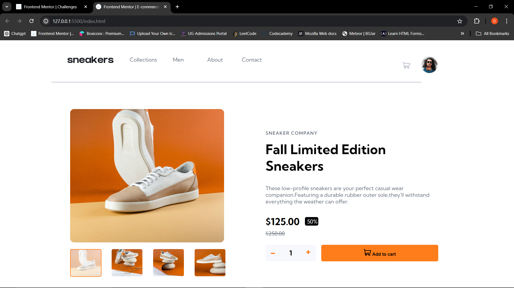

# Frontend Mentor - E-commerce product page solution

This is a solution to the [E-commerce product page challenge on Frontend Mentor](https://www.frontendmentor.io/challenges/ecommerce-product-page-UPsZ9MJp6). Frontend Mentor challenges help you improve your coding skills by building realistic projects.

## Table of contents

- [Overview](#overview)
  - [The challenge](#the-challenge)
  - [Screenshot](#screenshot)
  - [Links](#links)
- [My process](#my-process)
  - [Built with](#built-with)
  - [What I learned](#what-i-learned)
  - [Continued development](#continued-development)
  - [Useful resources](#useful-resources)
- [Author](#author)


## Overview

### The challenge

Users should be able to:

- View the optimal layout for the site depending on their device's screen size
- See hover states for all interactive elements on the page
- Open a lightbox gallery by clicking on the large product image
- Switch the large product image by clicking on the small thumbnail images
- Add items to the cart
- View the cart and remove items from it

### Screenshot




### Links

- Solution URL: [Add solution URL here](https://your-solution-url.com)
- Live Site URL: [Add live site URL here](https://your-live-site-url.com)


### Built with

- Semantic HTML5 markup
- CSS custom properties
- Flexbox

### What I learned

I learnt how to create a slideshow and also understand and create good layouts
And also use two different css files for one html file

```html
<div class="slideshow_container">
      <div class="slideshow_wrapper"></div>       
      <div class="close_button" onclick="Close()">
        <svg  class="hoverable" width="14" height="15" xmlns="http://www.w3.org/2000/svg"><path d="m11.596.782 2.122 2.122L9.12 7.499l4.597 4.597-2.122 2.122L7 9.62l-4.595 4.597-2.122-2.122L4.878 7.5.282 2.904 2.404.782l4.595 4.596L11.596.782Z"  /></svg>
      </div>

      <div class="slide"></div>
      <div class="slide"></div>
      <div class="slide"></div>
      <div class="slide"></div>

      <div class="next_prev">
      <div class="prev" id="prev" onclick ="plusSlides(-1)">
        <svg width="12" height="18" xmlns="http://www.w3.org/2000/svg"><path d="M11 1 3 9l8 8"  stroke-width="3" stroke="#none" fill="none" fill-rule="evenodd"/></svg>
      </div>
      <div class="next" id="next" onclick="plusSlides(1)">
        <svg width="13" height="18" xmlns="http://www.w3.org/2000/svg"><path d="m2 1 8 8-8 8" stroke="#none" stroke-width="3" fill="none" fill-rule="evenodd"/></svg>
      </div>
      </div>
      <div class="slide_thumbnail">
        <div class="thumbnail active" onclick="currentSlide(1)">  </div>
        <div class="thumbnail"  onclick="currentSlide(2)">  </div>
        <div class="thumbnail"  onclick="currentSlide(3)">  </div>
        <div class="thumbnail"  onclick="currentSlide(4)">  </div>
      </div>
    </div>
```
```css
.slideshow_container{
    top: 0;
    left: 0;
    width: 100%;
    display: none;
}
.slideshow_container .slideshow_wrapper{
    position: absolute;
    top: 0;
    background-color: var(--black);
    width: 100%;
    height: 100vh;
    opacity: 0.7;
    /* display: none; */
}
.slideshow_container  .slide{
    z-index: 1;
    top: 0;
    position: absolute; 
    justify-content: center;
    transform: translate(100%,33%);
    display: block ;
}
.slideshow_container .slide img{
    width: 460px;
    height:450px;
    border-radius: 12px;
   
}
/* close button,next and previous button */

.slideshow_container  .close_button{
   position: absolute;
   top: 6.5rem;
   left: 59%;
}
.slideshow_container  .close_button svg
{
    fill: var(--white);
}
.slideshow_container  .close_button svg:hover {
fill: var(--orange);
stroke: var(--orange);
cursor: pointer;
z-index: 2;
}
.slideshow_container  .next_prev{
    position: absolute;
   top: 45%;
   left: 28.3%; 
   z-index: 2;
   display: flex;
   gap: 26rem;
   justify-content: center;
}
.slideshow_container  .next_prev .next,
.slideshow_container  .next_prev .prev{
    background-color: var(--white);
    height: 50px;
    width: 50px;
    border-radius: 50%;
    padding: 1rem;
    cursor: pointer;
}
.slideshow_container  .next_prev .next svg,
.slideshow_container  .next_prev .prev svg{
    fill: var(--white);
    /* stroke: var(--white); */
    stroke:#000;
    position: absolute;
}
.slideshow_container  .next_prev .next svg:hover,
.slideshow_container  .next_prev .prev svg:hover{
    fill: var(--white);
    stroke:var(--orange)

}
.slideshow_container  .next_prev .prev{
    left: 0;
}

.slideshow_container .slide_thumbnail{
    display: flex;
    position: absolute;
    left: 30%;
    gap: 2rem;
}
.slideshow_container .slide_thumbnail .thumbnail img{
    width: 90px;
    height: 80px;
    border-radius: 5px;
    z-index: 0;
    cursor: pointer;
   
}
.active:before{
    content: "";
    border: 2px solid var(--orange);
    background: #ffffffa5;
    border-radius: 5px;
    z-index:0;
    transition: all .4s ease;
    position: absolute;
    height: 80px;
    width: 90px;
}

```
```js
// For slideshow
let slideshow = document.querySelector(".slideshow_container")
let slideIndex = 1;
showSlides(slideIndex);

function plusSlides(n) {
  showSlides(slideIndex += n);
  console.log(slideIndex)
}

function currentSlide(n) {
  showSlides(slideIndex = n);
}

function showSlides(n) {
  let i;
  let slides = document.getElementsByClassName("slide");
  let dots = document.getElementsByClassName("thumbnail");
  if (n > slides.length) {
    slideIndex = 1
}    
  if (n < 1) {
    slideIndex = slides.length
}
  for (i = 0; i < slides.length; i++) {
    slides[i].style.display = "none";  
  }
  for(i = 0;i < dots.length;i++){
    dots[i].className=dots[i].className.replace("active" ," ")
  }
  slides[slideIndex-1].style.display = "block";  
  dots[slideIndex-1].className += " active";
}
```

### Continued development
I would like to continue studying more of creating slideshows

### Useful resources

- [Resource 1](https://www.w3schools.com/howto/howto_js_slideshow.asp) - This helped me  with site. 


## Author

- Website - [Add your name here](https://www.your-site.com)
- Frontend Mentor - [@yourusername](https://www.frontendmentor.io/profile/yourusername)
- Twitter - [@yourusername](https://www.twitter.com/yourusername)

